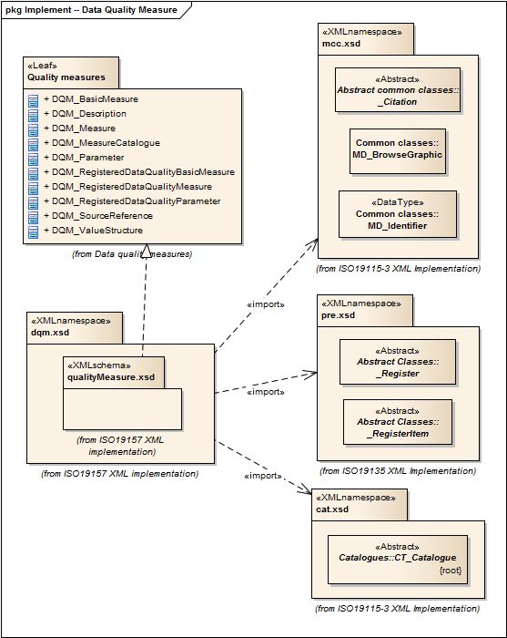

= Data Quality Measures (DQM)
:edition: 1.0
:revdate: 2019-01-04

== Data Quality Measures (DQM) Version: 1.0

=== Description

DQM 1.0 is an XML Schema implementation derived from ISO 19157, Geographic
Information - Data Quality, Clause 6.5. It includes elements for describing data
quality measures. The XML schema was encoded using the rules described in ISO/TS
19139:2007, Clause 8 and implementation approach from ISO/TS19115-3, Clause 8.

=== Sample XML files for dqm 1.0

* link:dqm.xml[dqm.xml]
* link:dqm_invalid.xml[dqm_invalid.xml]
* link:dqm_valid.xml[dqm_valid.xml]

=== CodeLists for dqm 1.0

* link:codelists.html[codelists.html]
* link:codelists.xml[codelists.xml]

=== XML Namespace for dqm 1.0

The namespace URI for dqm 1.0 is `http://standards.iso.org/iso/19157/-2/dqm/1.0`.

=== XML Schema for dqm 1.0

link:dqm.xsd[dqm.xsd] is the XML Schema document to be referenced by XML documents
containing XML elements in the dqm 1.0 namespace or by XML Schema documents importing
the dqm 1.0 namespace. This XML schema includes (indirectly) all the implemented
concepts of the dqm namespace, but it does not contain the declaration of any types.

NOTE: The XML Schema for dqm 1.0 are available link:dqm.zip[here]. A zip archive
including all the XML Schema Implementations defined in ISO/TS 19115-3 and related
standards is also
https://schemas.isotc211.org/19115/19115AllNamespaces.zip[available].

=== Related XML Schema for dqm 1.0

link:qualityMeasures.xsd[qualityMeasures.xsd] implements the UML conceptual schema
defined in ISO 19157, Geographic Information - Data Quality, Clause 6.5. It was
created using the encoding rules defined in ISO 19118, ISO 19139, and the
implementation approach described in ISO 19115-3 and contains the following classes
(codeLists are bold): DQM_BasicMeasure, DQM_Description, DQM_Measure,
DQM_MeasureCatalogue, DQM_Parameter, DQM_RegisteredDataQualityBasicMeasure,
DQM_RegisteredDataQualityMeasure, DQM_RegisteredDataQualityParameter,
DQM_SourceReference, and DQM_ValueStructure

=== Related XML Namespaces for dqm 1.0

The dqm 1.0 namespace imports these other namespaces:

[%unnumbered]
[options=header,cols=4]
|===
| Name | Standard Prefix | Namespace Location | Schema Location

| CATalogue | cat |
`https://schemas.isotc211.org/19115/-3/cat/1.0` | https://schemas.isotc211.org/19115/-3/cat/1.0/cat.xsd[cat.xsd]
| Geographic COmmon | gco |
`https://schemas.isotc211.org/19115/-3/gco/1.0` | https://schemas.isotc211.org/19115/-3/gco/1.0/gco.xsd[gco.xsd]
| Metadata Common Classes | mcc |
`https://schemas.isotc211.org/19115/-3/mcc/1.0` | https://schemas.isotc211.org/19115/-3/mcc/1.0/mcc.xsd[mcc.xsd]
| Procedures for Registration | pre |
`https://schemas.isotc211.org/19135/-2/pre/1.0` | https://schemas.isotc211.org/19135/-2/pre/1.0/pre.xsd[pre.xsd]
|===

=== Schematron Validation Rules for dqm 1.0

Schematron rules for validating instance documents of the dqm 1.0 namespace are in
link:dqm.sch[dqm.sch]. Other schematron rule sets that are required for a complete
validation are: cat.sch, mcc.sch, pre.sch, gco.sch, cat.sch, mcc.sch, and pre.sch

=== Working Versions

When revisions to these schema become necessary, they will be managed in the
https://github.com/ISO-TC211/XML[ISO TC211 Git Repository].
