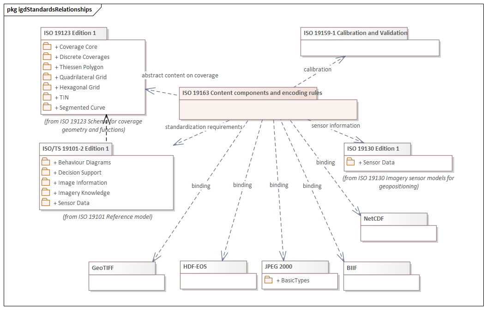

= Image and Gridded Data (IGD)
:edition: 1.1.0
:revdate: 2010-02-26

== Image and Gridded Data (IGD) Version 1.1.0

.Overview of classes in the igd namespace

=== Description

Image and Gridded Data (IGD) is an XML Schema implementation of abstract classes for
ISO 19163, Geographic Information - Content components and encoding rules for imagery
and gridded Data. It includes elements for defining geometry and functions for
coverages. The XML schema was encoded using the encoding rules defined in ISO 19118,
ISO 19139.

=== XML Namespace for Image and Gridded Data (IGD) Version: 1.1

The namespace URI for Image and Gridded Data (IGD) Version 1.1.0 is
`https://schemas.isotc211.org/19163/-1/igd/1.1`.

=== XML Schema for Image and Gridded Data (IGD) Version 1.1.0

https://schemas.isotc211.org/19163/-1//igd/1.1.0/igd.xsd[igd.xsd] is the XML Schema document to
be referenced by XML documents containing XML elements in the igd namespace or by XML
Schema documents importing the igd 1.1 namespace. This XML schema includes
(indirectly) all the implemented concepts of the igd namespace, but it does not
contain the declaration of any types.

=== Related XML Schema for igd 1.1

https://schemas.isotc211.org/19163/-1/igd/1.1.0/IE_ImageryAndGriddedData.xsd
implements the UML conceptual schema defined in ISO 19163, Geographic Information -
Content components and encoding rules for imagery and gridded Data. It was created
using the encoding rules defined in ISO 19118, ISO 19139.

https://schemas.isotc211.org/19163/-1/igd/1.1.0/IE_ImageryAndGriddedData.xsd
contains the following classes:

* CV_AbstractCoverage
* CV_CommonPointRule
* SC_CRS
* IE_ImageryAndGriddedData
* CV_InterpolationMethod
* IE_Georectified
* IE_LocationGCP
* IE_Georeferenceable
* SD_SensorModel
* SD_GCPRepository
* SD_ImageIdentifiableGCP
* SD_GCPLocation
* CV_GridCoordinates

https://schemas.isotc211.org/19163/-1/igd/1.1.0/IE_ImageryAndGriddedData.xsd
contains the following codelist/enumerations:

* IE_GeolocationSourceCode
* IE_GeometricCorrectionModelCode

https://schemas.isotc211.org/19163/-1/igd/1.1.0/IE_ThematicGriddedData.xsd
implements the UML conceptual schema defined in ISO 19163, Geographic Information -
Content components and encoding rules for imagery and gridded Data. It was created
using the encoding rules defined in ISO 19118, ISO 19139.

https://schemas.isotc211.org/19163/-1/igd/1.1.0/IE_ThematicGriddedData.xsd
contains the following classes:

* IE_ThematicGriddedData
* IE_CategoricalGriddedData
* IE_NumericalGriddedData
* IE_CategoricalValueAndColour
* IE_ColourPalette

https://schemas.isotc211.org/19163/-1/igd/1.1.0/IE_Imagery.xsd
implements the UML conceptual schema defined in ISO 19163, Geographic Information -
Content components and encoding rules for imagery and gridded Data. It was created
using the encoding rules defined in ISO 19118, ISO 19139.

https://schemas.isotc211.org/19163/-1/igd/1.1.0/IE_Imagery.xsd
contains the following classes:

* IE_MosaicElement
* IE_Imagery
* IE_OpticalImage
* IE_ActiveMWData
* IE_PassiveMWData
* IE_SARData
* IE_SARComplexData
* IE_SARDopplerCentroidParameter
* IE_OrbitParameter
* IE_SARAmplitudeData
* IE_RadiometerData
* IE_PMWBand
* IE_PMWChannelInfo
* IE_SyntheticImage
* IE_SimulatedImage
* IE_FusedImage
* IE_SARSensor

https://schemas.isotc211.org/19163/-1/igd/1.1.0/IE_Imagery.xsd
contains the following codelist/enumerations:

* IE_ProcessingActionCode
* IE_RadiometricCalibrationTypeCode
* IE_OpticalImageTypeCode
* IE_OpticalSensorTypeCode
* IE_SARImagingModeCode
* IE_SARComplexLayerCode
* IE_PMWScanningModeCode
* IE_PMWBandNameCode
* IE_PMWApertureTypeCode
* IE_ChannelPropertyCode

https://schemas.isotc211.org/19163/-1/igd/1.1.0/dataQualityElement.xsd
implements the UML conceptual schema defined in ISO 19163, Geographic Information -
Data Quality. It was created using the encoding rules defined in ISO 19118, ISO
19139.

.Classes in the data quality elements schema of igd namespace
image::igdElementsClass.png[UML diagram of classes in the data quality elements schema from Metadata for Data Quality (IGD) in the igd namespace,750]

https://schemas.isotc211.org/19163/-1/igd/1.1.0/dataQualityElement.xsd
contains the following classes:

* DQ_AbsoluteExternalPositionalAccuracy
* DQ_AccuracyOfATimeMeasurement
* AbstractDQ_Completeness
* DQ_CompletenessCommission
* DQ_CompletenessOmission
* DQ_ConceptualConsistency
* DQ_DataInspection
* DQ_DataQuality
* DQ_DomainConsistency
* AbstractDQ_Element
* DQ_FormatConsistency
* DQ_GriddedDataPositionalAccuracy
* AbstractDQ_LogicalConsistency
* DQ_MeasureReference
* DQ_NonQuantitativeAttributeCorrectness
* AbstractDQ_PositionalAccuracy
* DQ_QuantitativeAttributeAccuracy
* DQ_RelativeInternalPositionalAccuracy
* DQ_StandaloneQualityReportInformation
* DQ_TemporalConsistency
* AbstractDQ_TemporalQuality
* DQ_TemporalValidity
* AbstractDQ_ThematicAccuracy
* DQ_ThematicClassificationCorrectness
* DQ_TopologicalConsistency
* DQ_UsabilityElement

=== Related XML Namespaces for ISO 19163 IGD 1.2

The IGD 1.2.0 imports these other namespaces:

[%unnumbered]
[options=header,cols=4]
|===
| Name | Standard Prefix | Namespace Location | Schema Location

| Geographic Common Objects | gco |
`https://schemas.isotc211.org/19103/-/gco/1.2.0` | https://schemas.isotc211.org/19103/-/gco/1.2.0/gco.xsd[gco.xsd]
| CITation and responsibility | cit |
https://schemas.isotc211.org/19115/-1/cit/1.3 | https://schemas.isotc211.org/19115/-1/cit/1.3.0/cit.xsd[cit.xsd]
| Geographic EXtent | gex |
https://schemas.isotc211.org/19115/-1/gex/1.3 | https://schemas.isotc211.org/19115/-1/gex/1.3.0/gex.xsd[gex.xsd]
| Metadata for Resource Identification | mri |
https://schemas.isotc211.org/19115/-1/mri/1.3 | https://schemas.isotc211.org/19115/-1/mri/1.3.0/mri.xsd[mri.xsd]
| Metadata for Spatial Representation | msr |
https://schemas.isotc211.org/19115/-1/msr/1.3 | https://schemas.isotc211.org/19115/-1/msr/1.3.0/msr.xsd[msr.xsd]
| Metadata Resource Content | mrc |
https://schemas.isotc211.org/19115/-1/mrc/1.3 | https://schemas.isotc211.org/19115/-1/mrc/1.3.0/mrc.xsd[mrc.xsd]
| Metadata fgor ACquisuition | mac |
https://schemas.isotc211.org/19115/-2/mac/2.2 | https://schemas.isotc211.org/19115/-2/mac/2.2.0/mac.xsd[mac.xsd]
| Geographic Markup Language | gml |
http://schemas.opengis.net/gml/3.2 |
http://schemas.opengis.net/gml/3.2.1/gml.xsd
| Geographic Markup language Wrapper | gml |
https://schemas.isotc211.org/19136/-/gmw/1.1 | https://schemas.isotc211.org/19136/-/gmw/1.1.0/gmw.xsd
| Application Schema for Coverages | gmlcov |
http://schemas.opengis.net/gmlcov/1.0 |
http://schemas.opengis.net/gmlcov/1.0/coverage.xsd
|===

=== Working Versions

When revisions to these schema become necessary, they will be managed in the
https://github.com/ISO-TC211/XML[ISO TC211 Git Repository].
